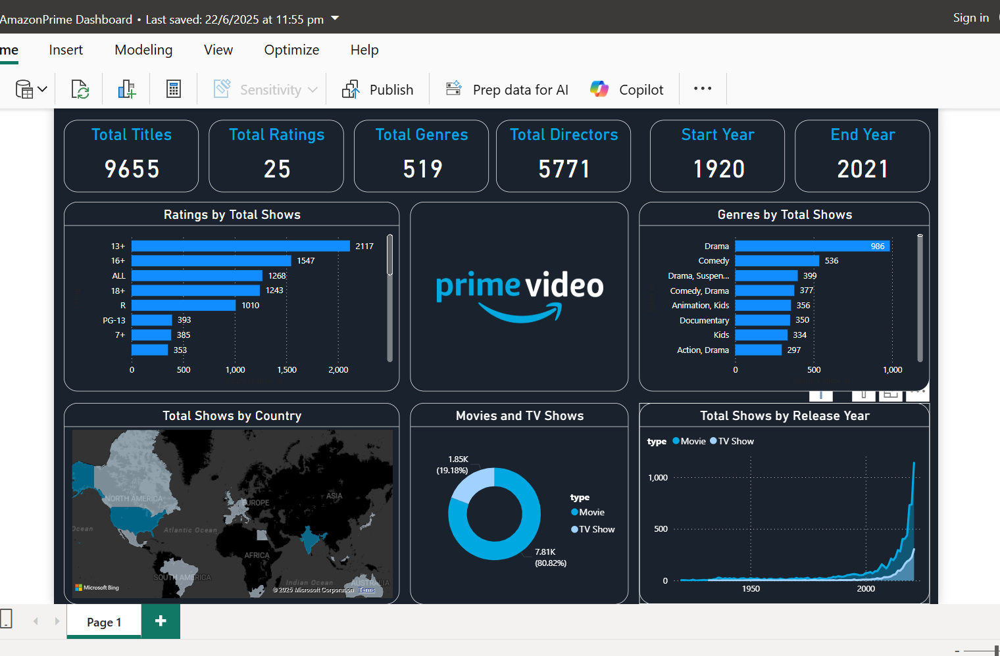

# 📊 Amazon Prime Dashboard

A comprehensive **data analysis project on Amazon Prime content**, visualized with **Power BI** and backed by **Python-based exploratory data analysis**.

---

## 📁 Project Overview

This project dives into a dataset of Amazon Prime movies and shows to extract insights about:

- Content distribution by type, genre, release year
- Actor/director frequencies
- Duration trends of content
- Global content availability
- Ratings and popularity trends

The project leverages:
- 🔬 **Python** (Jupyter Notebook) for data cleaning and analysis
- 📊 **Power BI** for interactive dashboard and visual storytelling

---

## 🛠️ Tech Stack

| Tool | Purpose |
|------|---------|
| Python | Data Cleaning & EDA |
| Pandas, NumPy, Matplotlib, Seaborn | Data wrangling and visualizations |
| Jupyter Notebook | Python coding environment |
| Power BI | Business Intelligence Dashboard |
| Bootstrap | Styling for UI (optional or for related web demo) |

---

## 📂 Folder Structure
│
├── data/
│ └── amazon_prime_titles.csv
│
├── notebooks/
│ └── eda_amazon_prime.ipynb
│
├── powerbi/
│ └── amazon_dashboard.pbix
│
├── README.md
└── requirements.txt


---

## 📷 Screenshots

### 🔍 EDA Sample (Python)


### 📊 Power BI Dashboard


---

## 🚀 Key Insights

- 📅 Most content is added in recent years, especially post-2017.
- 🎭 Dramas and Documentaries are the most common genres.
- 🌍 Majority of content is produced in the US, UK, and India.
- 🎬 Average duration of movies is around 90 minutes.
- 👤 Repeated appearance of certain directors and actors.

---

## 📌 How to Run

1. **Clone the repository**
   ```bash
   git clone https://github.com/Kunal9988/AmazonPrimeDashboard.git

